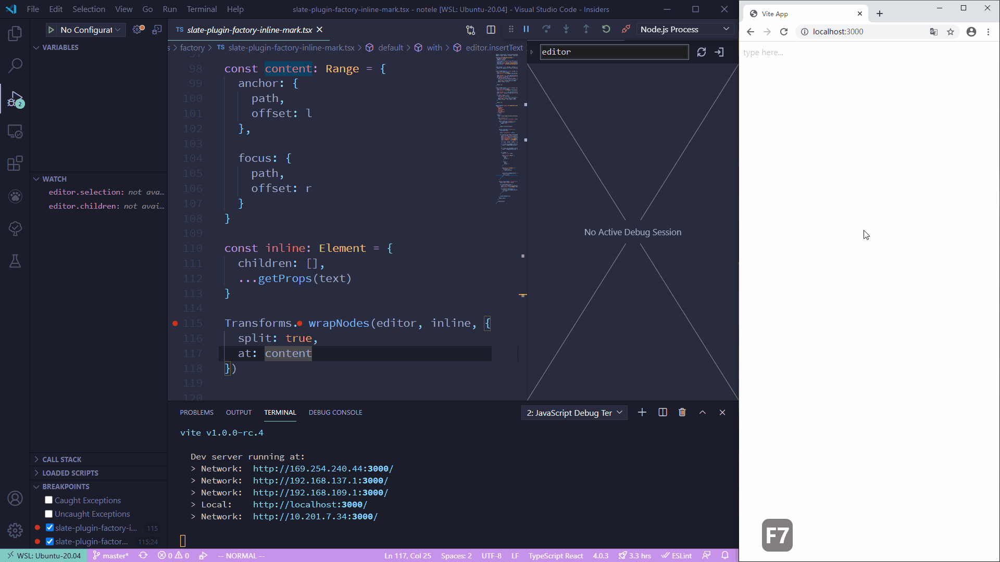

# slate-debug-visualizer

## Overview

`slate-debug-visualizer` is a [slate](https://github.com/ianstormtaylor/slate) integration for [vscode-debug-visualizer](https://marketplace.visualstudio.com/items?itemName=hediet.debug-visualizer). It provides visualization of slate document model, making debugging slate editor easlier.



## Installation

```bash
# using npm
npm install slate-debug-visualizer --save

# or using yarn
yarn add slate-debug-visualizer
```

## Usage

Just apply the plugin `withVisualization` on your slate editor and the visualization is available in `vscode-debug-visualizer`

```ts
import { withVisualization } from 'slate-debug-visualizer'
const editor = () => withVisualization(createEditor())
```

## Demo

A simple demo here

```tsx
import React, { useCallback, useMemo, useState } from 'react'
import { withVisualization } from 'slate-debug-visualizer'
import { createEditor, Node } from 'slate'
import { Slate, Editable, withReact } from 'slate-react'
import { withHistory } from 'slate-history'

function App() {
  const editor = useMemo(() => {
    return withVisualization(withHistory(withReact(createEditor())))
  }, [])

  const [value, setValue] = useState<Node[]>([{
    children: [{ text: '' }]
  }])

  const onClick = useCallback(() => {
    // set breakpoint here
    // open a new debug visualizer view
    // enter `editor` see the visualization
    console.log(editor)
  }, [])

  return (
    <Slate editor={editor} value={value} onChange={setValue}>
      <button onClick={onClick}>
        Pause
      </button>

      <Editable placeholder={"type here..."}></Editable>
    </Slate>
  )
}
```
